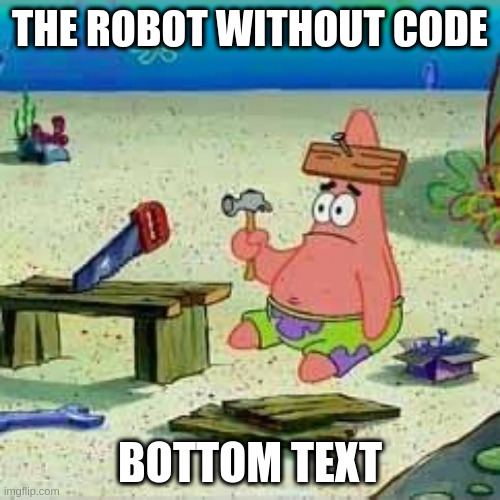
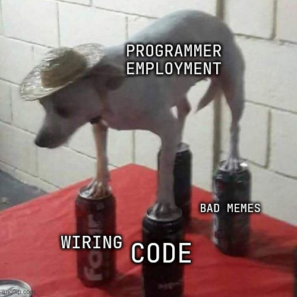
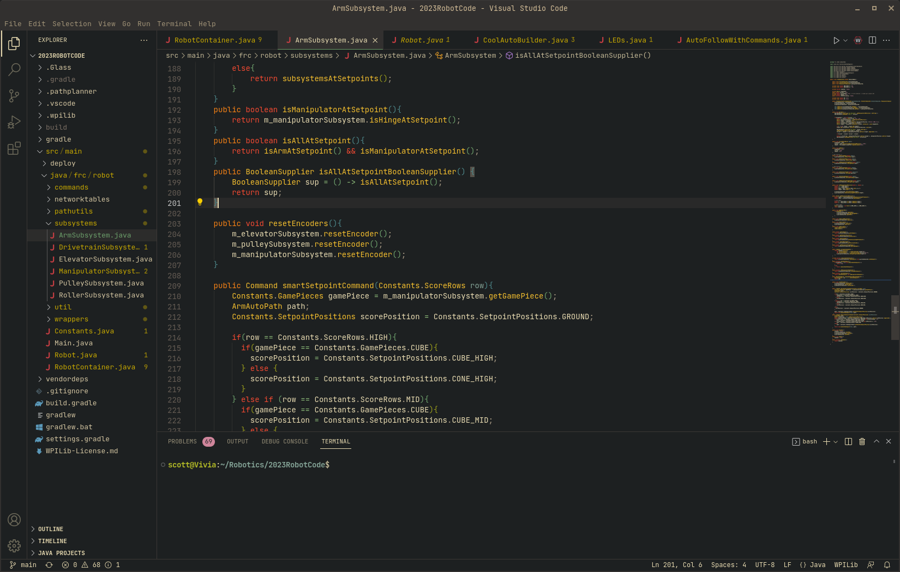
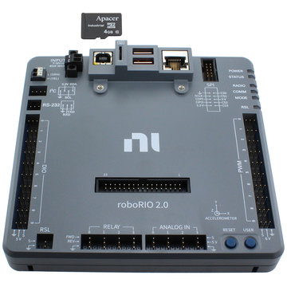
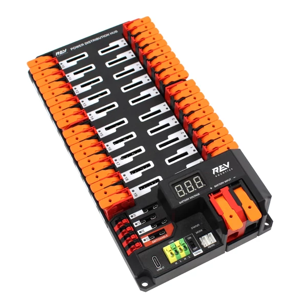
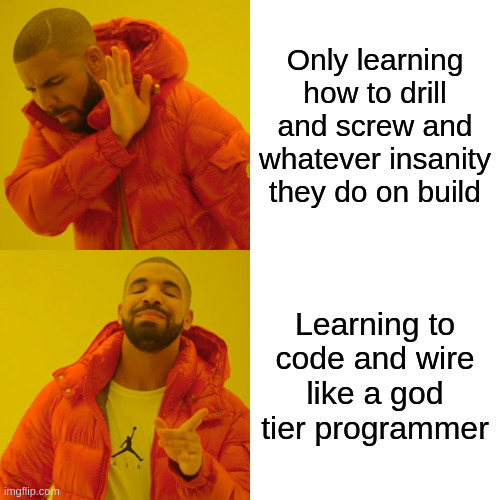

# Lesson 0: So You Want To Code A Robot
Greetings aspiring programmer! We are so excited to see you deciding to join a cult and send cryptic symbols into the depths of a computer so that robot go brrr and fly around the room. :D
 
Photo by [Kevin Ku](https://unsplash.com/photos/w7ZyuGYNpRQ)

# Why We Need Programmers
We as programmers are an essential aspect of the Haywire workflow. Each team is necessary: Public Resources make sure we have the money and the public involvement to build and compete, Field Build ensures that we are able to test the bot, and Build Team screws pieces of metal together to go zoom, Safety Captain keeps us from doing stupid, Drive Team pushes buttons on controllers, and so on.

But robots are, unfortunately, stupid. They have no concept of the game, their world, or even how to turn their motors. In addition, if build team just straps a motor to the bot and tries to plug it directly into a battery, it will blow up and burn down the shop. This is a big problem, almost as big as your mom. These are the kinds of problems that we as programmers solve.

# Responsibilities of a Programmer
There are two main things that we are programmers have to do for the team: **Programing/Code** and **Wiring/Electronics**. You do not need to be proficient in both to be a programmer, but it is recommended that you learn each, both to ensure that you can help the team in any capacity needed, but also to make yourself a more well-rounded.

If you choose to become a programmer, and I hope you do, it will require learning at least one of these skills and actively using it to help the team. There are countless people here on Haywire to help you, as well as these guides.

# Programming and Code
This is my personal favorite part of being a programmer, and arguably one of the rarest and most needed skills in FRC (other than soft skills, although those are a bit less rare). Programming is the art and science of creating instructions for a computer. Founded by Ada Lovelace in 1843, programming, or coding as the cool kids say, has grown to encompass nearly every aspect of computers. We use it to structure the the robot's behavior and make big hunk of metal go zoom.
## Programming Language: Java
Just like how there are many human languages, English, Spanish, elvish, there are many programming languages. They allow us to convert our ideas and instructions for the robot into binary, 1's and 0's, that the robot can understand and use. The major programming language we use in Haywire is Java, and yes, you can use it even if you don't drink coffee. To learn some about what Java is and how we use code, go [here](./Coding_For_Beginners.md).

## IDE: Visual Studio Code
The main tool for programming is an Integrated Development Environment (IDE), which is what allows us to write code at blazing speed. Haywire's weapon of choice, and the standard for FRC teams everywhere, is Visual Studio Code, a highly customizable and fantastic code editor. It has extensive autocomplete and debugging features that help make coding faster and easier, especially for beginners.

## Libraries and Tools
It is really, really hard to write all code needed for a robot from scratch. Nigh impossible even. Thus, we programmers use libraries that contain already written code passed down on high by people who have taken the time to meticulously develop all of it. The main library used in FRC is WPILib, which contains most code needed to make a robot go zoom. You can actually install the WPILib tools on your home computer to work on robotics on your own time. If you would like to get started then go [here](https://docs.wpilib.org/en/stable/docs/software/what-is-wpilib.html).

# Wiring and Electronics
The first thing that we are programmers are in charge of doing is wiring the robot. Nothing goes anywhere unless it has power. So programmers need wire up several aspects of the bot each year to ensure that it is able to run. We need to find a place for the electronics board with all relevant components to be placed. The two major components of electronics are shown below, but there are many other parts that you will need to understand over time.
## roboRIO
The roboRIO is the brains of any bot. On it lies all of the instructions and computing power that we utilize to make the robot move in autonomous and teleoperated parts of competition. This is the part of the bot all cables, sensors, and motor controllers plug into. It is the device to which we upload code through the radio.

Photo by [AndyMark](https://www.andymark.com/products/ni-roborio-2)
## Power Distribution Hub
The Power Distribution Hub (PDH) is the central point for power to the robot. This is where all power cables get plugged in, and what the battery is wired to. As a programmer, you get to care for and set up the bot's PDH.

Photo by [REV Robotics](https://www.revrobotics.com/rev-11-1850/)

# Where To Go From Here
Well, that's programming. Add in a bunch of pain, satisfying cable management, and time spent making your code pretty, and that wraps it up. From here, if you are feeling psyched about becoming a programmer, than there a couple things you should do.
The first one, is to go to the #programming channel on Haywire's discord and introduce yourself and ask for some mentoring. Always begin with your team.
Next, read through these guides. The will be able to help you understand the basics of coding, wiring, FRC programming practices, Haywire code standards, and more.
Also, don't stress not understanding stuff at first. Programming is a complicated skill, but an incredibly valuable one. I started coding almost 6 years ago, and I don't even know everything.
Be prepared for it to be a lot of fun though. You won't regret being a programmer.
