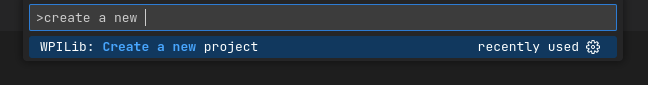
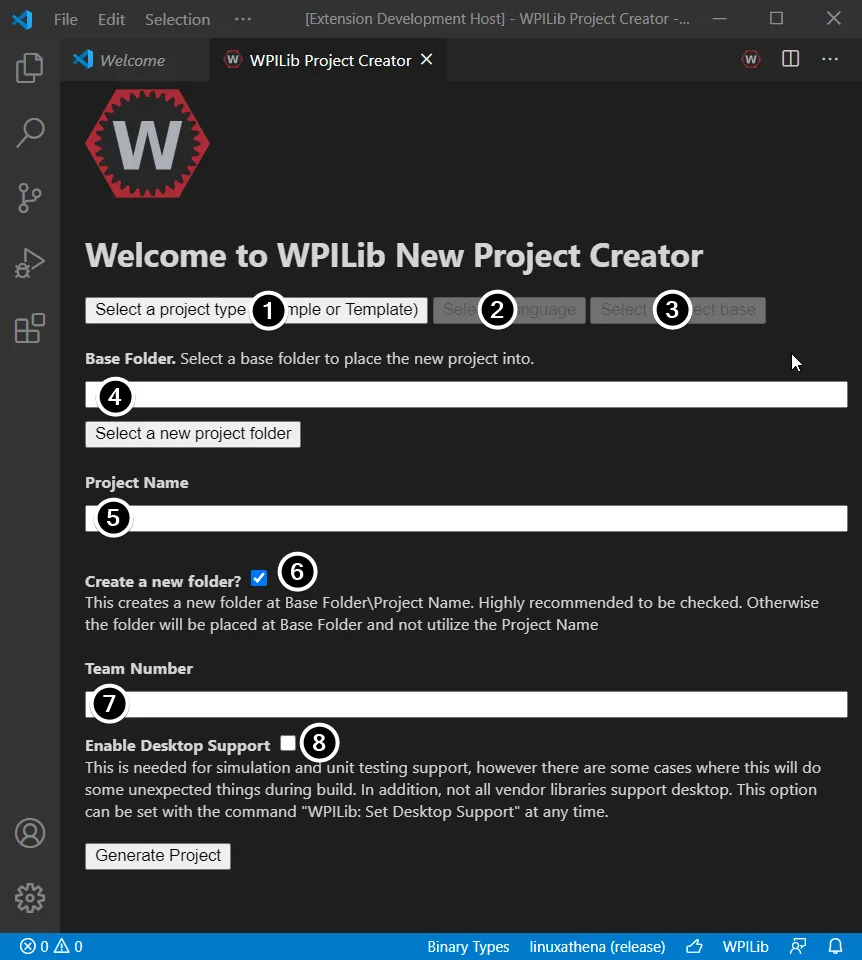

# Lesson 3: Starting a Robot Codebase
So here you are. You've fought all the way through the last three tutorials to get to this one. You've learned what we do in programming, the basics of what code is, and even installed your toolkit. Now all that's left to do is... build the codebase. Here we'll go over that part, looking at how to create a codebase in WPILib, as well as the basic structure of a WPILib project. This tutorial bears significant resemblance to the ["Creating your Test Drivetain Program (C++/Java)"](https://docs.wpilib.org/en/stable/docs/zero-to-robot/step-4/creating-test-drivetrain-program-cpp-java.html) tutorial from WPILib, so it is recommended to read that as well, although not at all required.
# Creating a Codebase
WPILib contains a very useful tool in the command prompt for just this use. Open up an empty VS Code window and hit `Ctrl + Shift + P`, or click on the WPILib logo in the upper righthand corner. Now if you type in `Create a new project`, you should see the following option come up.

Hit enter and you will now see the following screen pop up. Follow the instructions below to create an example project with it.

Here's what each component means:
1. **Project Type:** There are two types of project that you can have, **Template** and **Example**. **Template** generates a new project for you that just has the bare bones needed to get going, but no functionality. **Example** is a set of pre-made projects used to help you learn. For production code you will always use **Template**, but for now hit **Example**.
2. **Language:** Self-explanatory. We use java so choose that, although C++ if pretty fun if you want a challenge that the rest of Haywire will probably not go along with you on.
3. **Project Base:** Selects the base template or example you wish to start the project from. For serious projects I would recommend **Command Robot** under **Template**, but for this example select 