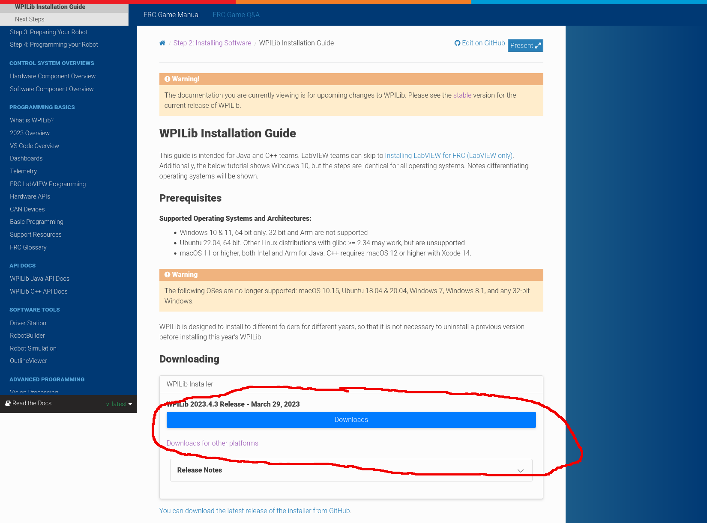

# Lesson 2: Your Toolkit
Now that you understand not just what we do on programming but also the basics of code, it's time to start putting together a kit of tools with which you can apply that knowledge. Build team has hammers and Alan wrenches, PR has printers and scissors, and Programming team has [VS Code](https://code.visualstudio.com/) and [WPILib](https://docs.wpilib.org/en/latest/docs/zero-to-robot/introduction.html). As with any tool, you are going to want to get familiar with them. In this lesson we will look at what each of these tools are and how to get them installed and running.
# WPILib Tools
Robotics are incredibly complicated pieces of machinery, and as such require some very complex electrical signals to run properly. We could, of course, try to make all of those signals from scratch, specifying exact amounts of voltage for the roboRIO to put out at certain times, checking the exact values of different controllers, etc. The problem is, _aint nobody got time fo dat_. So, we utilize tools that other people have created called **libraries**. Think of a software library as a collection of programs that different people have already written. We can go to that library, grab a program, and use it to make our life significantly easier and our code significantly better. [WPILib Tools](https://docs.wpilib.org/en/latest/docs/zero-to-robot/introduction.html) is a set of libraries and software that FRC has created for all robotics teams, and it is the core of all our programming efforts.
## Installing WPILib Tools
To install the software packages, go to the [WPILib Installation Guide](https://docs.wpilib.org/en/latest/docs/zero-to-robot/step-2/wpilib-setup.html). There you will find tutorials on how to do the install, but we will cover the first and most important steps here. Scroll down a little until you see this large download button.

# Visual Studio Code
Visual Studio Code (VS Code) is an industry standard code editor for writing, testing, and running programs in a wide variety of languages. Learning VS Code is actually *workforce training*, as it's what almost all professional software developers use on a daily basis. I had the chance to work as an intern at INL once, and VS Code was the tool of choice for most developers at the lab.

Visual Studio is an IDE, which stands of Integrated Development Environment. It provides you with a massive suite of tools that are ideally suited for writing Java, and it can help you understand and autocomplete parts of code when you get stuck. 
