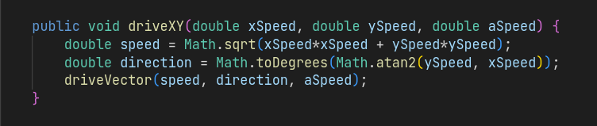
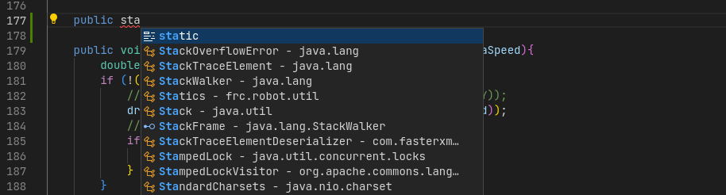
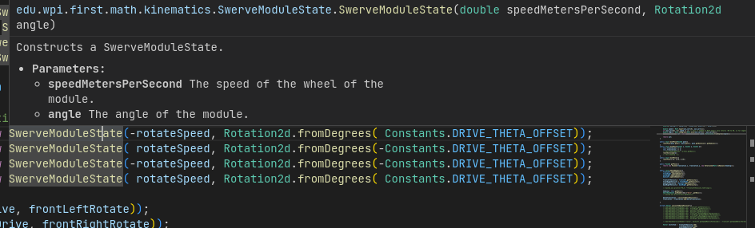

# Lesson 2: Your Toolkit
Now that you understand not just what we do on programming but also the basics of code, it's time to start putting together a kit of tools with which you can apply that knowledge. Build team has hammers and Alan wrenches, PR has printers and scissors, and Programming team has [VS Code](https://code.visualstudio.com/) and [WPILib](https://docs.wpilib.org/en/latest/docs/zero-to-robot/introduction.html). As with any tool, you are going to want to get familiar with them. In this lesson we will look at what each of these tools are and how to get them installed and running.
# WPILib Tools
Robotics are incredibly complicated pieces of machinery, and as such require some very complex electrical signals to run properly. We could, of course, try to make all of those signals from scratch, specifying exact amounts of voltage for the roboRIO to put out at certain times, checking the exact values of different controllers, etc. The problem is, _aint nobody got time fo dat_. So, we utilize tools that other people have created called **libraries**. Think of a software library as a collection of programs that different people have already written. We can go to that library, grab a program, and use it to make our life significantly easier and our code significantly better. [WPILib Tools](https://docs.wpilib.org/en/latest/docs/zero-to-robot/introduction.html) is a set of libraries and software that FRC has created for all robotics teams, and it is the core of all our programming efforts.
## Installing WPILib Tools
To install the software packages, go to the [WPILib Installation Guide](https://docs.wpilib.org/en/latest/docs/zero-to-robot/step-2/wpilib-setup.html). Follow the instructions there for your specific operating system. If you follow them properly then everything should work fine. Remember, we use Java at Haywire, not C++, so there is no need to follow any of the steps specific to C++. If you do run into problems, contact a team member or mentor for help.

There is one final aspect of this process to be aware of. When you reach a screen like the one below where it asks how to install VS Code, you need to chose "Download for this computer early". This ensures that you don't encounter any bugs or difficulties associated with mixing your WPILib install with other versions of VS Code.

# Visual Studio Code
If everything went okay on your install of WPILib earlier, VS Code should now be on your system. Visual Studio Code (VS Code) is an industry standard code editor for writing, testing, and running programs in a wide variety of languages. Learning VS Code is actually *workforce training*, as it's what almost all professional software developers use on a daily basis. I had the chance to work as an intern at INL once, and VS Code was the tool of choice for most developers at the lab.

What is VS Code? Well, all of the code that makes the robot run, as well as the libraries from WPILib that we mentioned earlier, are really just text files when it comes down to it. But just like how it would be a lot harder to write an essay in Windows' default notepad application than in Google Docs or Word, it is far harder to code a robot in plain text files than it is in VS Code. Visual Studio provides you with an extensive set of tools that make it easier to edit code. We'll go over a few of them below.

## Syntax Highlighting
One of the big things that VS Code does for you is syntax highlighting. [Syntax](https://en.wikipedia.org/wiki/Syntax) is just a fancy word for grammar. Just like the English language, programs have different types of words, like subjects, verbs, predicates, etc. But unlike English, those different types of words being the same color makes programs harder to read, not easier. For example, take this piece of the 2023 robot code that helped to drive the swerve modules.
```
public void driveXY(double xSpeed, double ySpeed, double aSpeed) {
	double speed = Math.sqrt(xSpeed*xSpeed + ySpeed*ySpeed);
	double direction = Math.toDegrees(Math.atan2(ySpeed, xSpeed));
	driveVector(speed, direction, aSpeed);
}
```
Pretty confusing, right? Even as someone who helped to write this code, it is hard to parse through what statements are doing what and what different values mean. Now let's see it with highlighting, as it appears in VS Code.

Now we can see what is just an operation on variables, what is a type definition, and so one, all from the colors. Don't worry if you don't understand the code still, that isn't the point. The point is that syntax highlighting will let you see things that you didn't see before, helping you code blazingly fast.
## Intellisense
Intellisense is essentially auto-correct for programmers. As you type you will see a box start to appear with options in it. You can hit `Tab` or `Enter` to autocomplete, and can even use the arrow keys to sort through the suggestions.

You can also hover over particular items to learn more about them, such as the parameters that they take, where they are defined, etc. This one is particularly helpful when trying to better understand a piece of code.

If you want to understand intellisense better, take a look at [this tutorial](https://code.visualstudio.com/docs/editor/intellisense).
## Video tutorial
Finally, take just a few minutes to go watch this tutorial that goes through VS Code's basics in 100 seconds.

# GitHub
The final essential tool to be covered in this tutorial is [GitHub](https://github.com). There is no worse case scenario for a programmer than to have the laptop with all of the team's code on it brick itself halfway through a competition, stopping them from fixing bugs and keeping the bot going through the Utah Regionals (this is a thing that *did and does happen*). How are we supposed to avoid this major nightmare? Backups. Backups backups backups.

GitHub is a cloud based solution for backing up and managing your code. You can see all of Haywire's code previous code at [the team's GitHub](https://github.com/HaywireRobotics). You want to backup (or push as it is called) your code regularly, and we will get into the details of that and best practices for it in later tutorials. For now, know that it exists and is exceedingly useful.

Nonetheless, there are a few places to go and learn now if you are interested. VS Code has GitHub integrated into the editor; go [here](https://code.visualstudio.com/docs/sourcecontrol/intro-to-git) if you want to learn how to use it. If you plan on doing development for the team at home instead of just at the shop then yo