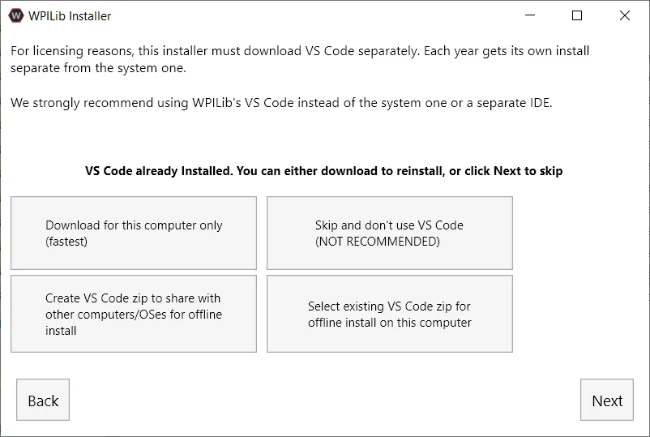
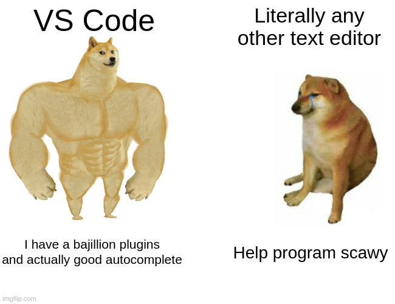

# Lesson 2: Your Toolkit
Now that you understand not just what we do on programming but also the basics of code, it's time to start putting together a kit of tools with which you can apply that knowledge. Build team has hammers and Alan wrenches, PR has printers and scissors, and Programming team has [VS Code](https://code.visualstudio.com/) and [WPILib](https://docs.wpilib.org/en/latest/docs/zero-to-robot/introduction.html). As with any tool, you are going to want to get familiar with them. In this lesson we will look at what each of these tools are and how to get them installed and running.
# WPILib Tools
Robotics are incredibly complicated pieces of machinery, and as such require some very complex electrical signals to run properly. We could, of course, try to make all of those signals from scratch, specifying exact amounts of voltage for the roboRIO to put out at certain times, checking the exact values of different controllers, etc. The problem is, _aint nobody got time fo dat_. So, we utilize tools that other people have created called **libraries**. Think of a software library as a collection of programs that different people have already written. We can go to that library, grab a program, and use it to make our life significantly easier and our code significantly better. [WPILib Tools](https://docs.wpilib.org/en/latest/docs/zero-to-robot/introduction.html) is a set of libraries and software that FRC has created for all robotics teams, and it is the core of all our programming efforts.
## Installing WPILib Tools
To install the software packages, go to the [WPILib Installation Guide](https://docs.wpilib.org/en/latest/docs/zero-to-robot/step-2/wpilib-setup.html). Follow the instructions there for your specific operating system. If you follow them properly then everything should work fine. Remember, we use Java at Haywire, not C++, so there is no need to follow any of the steps specific to C++. If you do run into problems, contact a team member or mentor for help.

There is one final aspect of this process to be aware of. When you reach a screen like the one below where it asks how to install VS Code, you need to chose "Download for this computer early". This ensures that you don't encounter any bugs or difficulties associated with mixing your WPILib install with other versions of VS Code.

# Visual Studio Code
If everything went okay on your install of WPILib earlier, VS Code should now be on your system. Visual Studio Code (VS Code) is an industry standard code editor for writing, testing, and running programs in a wide variety of languages. Learning VS Code is actually *workforce training*, as it's what almost all professional software developers use on a daily basis. I had the chance to work as an intern at INL once, and VS Code was the tool of choice for most developers at the lab.

What is VS Code? Well, all of the code that makes the robot run, as well as the libraries from WPILib that we mentioned earlier, are really just text files when it comes down to it. But just like how it would be a lot harder to write an essay in Windows' default notepad application than in Google Docs or Word, it is far harder to code a robot in plain text files than it is in VS Code. Visual Studio provides you with an extensive set of tools that make it easier to edit code. We'll go over a few of them below.

## Syntax Highlighting
One of the big things that VS Code does for you is syntax highlighting. 